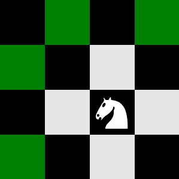

# Knight Game Against AI 🎮🤖

Challenge yourself in this strategic game where you compete against an AI-powered opponent using a knight on a chessboard.  

## 📜 Rules
- The game takes place on a chessboard with a knight starting at a **random position**.  
- **Valid Moves**:
  
  

- **Turn-Based Gameplay**: You and the AI take turns moving the knight.  
- **Objective**: The first player unable to make a valid move **loses**.

## 🚀 Features
- Play against an AI that calculates the best moves using the **Minmax algorithm**.  
- Get **hints** for optimal moves.  
- Simple and intuitive interface.

## 🎨 Tech Stack
- **Frontend**: React.js, TypeScript, Tailwind CSS.  
- **AI Logic**: Minmax algorithm.  

## 📚 Inspiration
This project was inspired by studying game theory. Learn more about the problem that inspired us [here](https://www.hackerrank.com/contests/5-days-of-game-theory/challenges/day-1-a-chessboard-game).

## 🙌 Team Contributions
- **Mina Magdy**
- **Efraim Nabil**

## 💬 Feedback
We’d love to hear your thoughts and see if you can beat the AI without using hints! 😊
